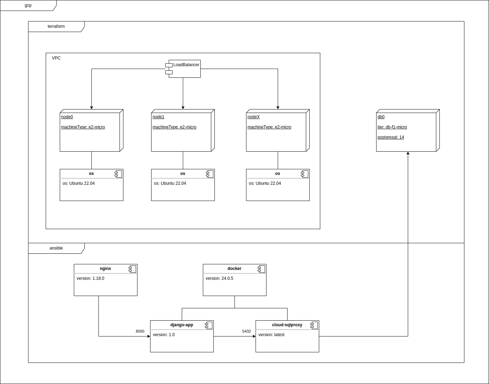

[//]: # "Title: ansible"
[//]: # "Author: Fabio Iareke"
[//]: # "Date: 2023-09-06"
[//]: # "File: ansible.md"
[//]: # "Summary: jBreadPaper about ansible"

# Ansible

https://www.ansible.com/

## Install

https://docs.ansible.com/ansible/latest/installation_guide/index.html

*pip*

```shell
pip install ansible
```

*OS: Ubuntu 22.04*

```shell
apt-add-repository ppa:ansible/ansible

apt install ansible
``` 

https://docs.ansible.com/ansible/2.8/user_guide/playbooks_best_practices.html

## Directory structure

```
project
├── group_vars
│   └── group_varX.yml
├── hosts.yml
├── host_vars
│   └── hostnameX.yml
├── roles
│   └── role
│       ├── defaults
│       │   └── main.yml
│       ├── files
│       │   └── a_file.ext
│       ├── handlers
│       │   └── main.yml
│       ├── meta
│       │   └── main.yml
│       ├── tasks
│       │   └── main.yml
│       └── templates
│           └── template_file.ext.j2
├── site.yml
└── tier.yml
```

## Basics

`hosts.yml`

```yml
[groupX]
hostnameX ansible_host=192.168.0.1 ansible_user=auser
hostnameY ansible_host=192.168.0.2 ansible_user=auser_or_another
```

`ping-playbook.yml`

```yml
---
- name: Test Ping
  hosts: all
  tasks:
  - action: ping
```

`update-playbook.yml`

```yml
---
- name: apt update
  hosts: groupX
  tasks:
  - name: update apt
    apt: update_cache=yes
    become: yes
```

```shell
ssh-copy-id -i ~/.ssh/id_ed25519 $USER@$HOST_IP
```

```shell
ansible -u $USER -i hosts.yml -a /usr/bin/uptime $PATTERN

ansible -u $USER -i hosts.yml -a /usr/bin/timedatectl $PATTERN

ansible -i hosts.yml -m ping $PATTERN

ansible -u $USER -i hosts.yml -m apt -a "upgrade=yes update_cache=yes cache_valid_time=86400" --become $PATTERN

ansible-playbook -i hosts.yml ping-playbook.yml

ansible-playbook -i hosts.yml update-playbook.yml -l $PATTERN
```

```
PATTERN := "all" | "group_name" | "hostname" | ...
```

## Usecase

Multi container django application running on Linux with nginx proxying.

### Architecture



### Files

```
django-app-ansible
├── group_vars
│   └── appgrp.yml
├── hosts.yml
├── roles
│   ├── app
│   │   ├── files
│   │   │   ├── credentials.json
│   │   │   └── env
│   │   └── tasks
│   │       └── main.yml
│   └── webserver
│       ├── files
│       │   └── default
│       ├── handlers
│       │   └── main.yml
│       └── tasks
│           └── main.yml
└── site.yml
```

`hosts.yml`

```yml
[appgrp]
node0 ansible_host=10.128.0.10 ansible_user=ubuntu
node1 ansible_host=10.128.0.11 ansible_user=ubuntu
nodeX ansible_host=10.128.0.12 ansible_user=ubuntu
```

`site.yml`

```yml
---
- hosts: appgrp
  roles:
    - webserver
    - app
```

`group_vars/appgrp.yml`

```yml
---
db_instance: instance_url
```

`roles/webserver/handlers/main.yml`

```yml
---
- name: restart nginx
  become: yes
  service:
    name: nginx
    state: restarted
```

`roles/webserver/tasks/main.yml`

```yml
---
- name: 'OS deps'
  become: yes
  apt:
    update_cache: yes
    cache_valid_time: 3600
    name: "{{ item }}"
    state: latest
  with_items:
    - nginx
- name: 'Enable proxy to port 8000'
  become: yes
  copy:
    src: 'files/default'
    dest: '/etc/nginx/sites-available/default'
  notify:
   - restart nginx
```

`roles/webserver/files/default`

```
...

location / {
    proxy_pass          http://localhost:8000;
    proxy_set_header    Host $host;
    proxy_set_header    X-Forwarded-Proto $scheme;
}
...
```

`roles/app/tasks/main.yml`

```yml
---
- name: 'OS deps'
  become: yes
  apt:
    update_cache: yes
    cache_valid_time: 3600
    name: "{{ item }}"
    state: latest
  with_items:
    - docker.io
- name: Copy env file
  become: yes
  copy:
    src: 'files/env'
    dest: '/var/tmp/env'
- name: Create cloudsql-secrets volume
  become: yes
  docker_volume:
    name: cloudsql-secrets
# change this!! \/ #
- name: Copy credentials file
  become: yes
  copy:
    src: 'files/credentials.json'
    dest: '/var/tmp/credentials.json'
- name: create container tmp
  become: yes
  docker_container:
    name: container_tmp
    image: alpine
    volumes:
      - cloudsql-secrets:/secrets
- name: copy credentials to cloudsql-secrets volume
  become: yes
  command: docker cp /var/tmp/credentials.json container_tmp:/secrets/
- name: remove container tmp
  become: yes
  docker_container:
    name: container_tmp
    state: absent
- name: Remove file credentials.json
  become: yes
  ansible.builtin.file:
    path: /var/tmp/credentials.json
    state: absent
# change this! /\ #
- name: Create app-net network 
  become: yes
  docker_network:
    name: app-net
- name: Start cloud-sqlproxy container
  become: yes
  docker_container:
    name: cloud-sqlproxy
    image: gcr.io/cloudsql-docker/gce-proxy
    ports: "5432:5432"
    networks:
      - name: app-net 
    command: "/cloud_sql_proxy --dir=/cloudsql -instances={{ db_instance }}=tcp:0.0.0.0:5432 -credential_file=/secrets/credentials.json"
    volumes:
      - cloudsql:/cloudsql
      - cloudsql-secrets:/secrets/
- name: Start django-app container with env file
  become: yes
  docker_container:
    name: django-app
    image: django-app_image
    env_file: /var/tmp/env
    ports:
      - "8000:8000"
    networks:
      - name: app-net
- name: Remove file env
  become: yes
  ansible.builtin.file:
    path: /var/tmp/env
    state: absent
```

`roles/app/files/env`

```shell
SECRET_KEY=a_secret_key

PG_DB_NAME=db_name
PG_DB_USER=db_user
PG_DB_PASSWORD=db_password
PG_DB_HOST=cloud-sqlproxy
PG_DB_PORT=5432

BUCKET_URL=https://abucket.url/static/
```

`roles/app/files/credentials.json`: credentials file

### Exec

```shell
ansible-playbook site.yml -i hosts.yml 
```


# misc

https://www.redhat.com/en/technologies/management/ansible/hybrid-cloud