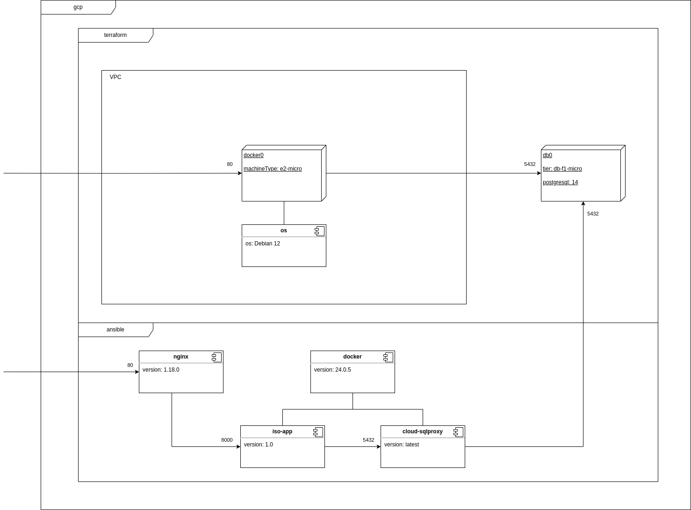
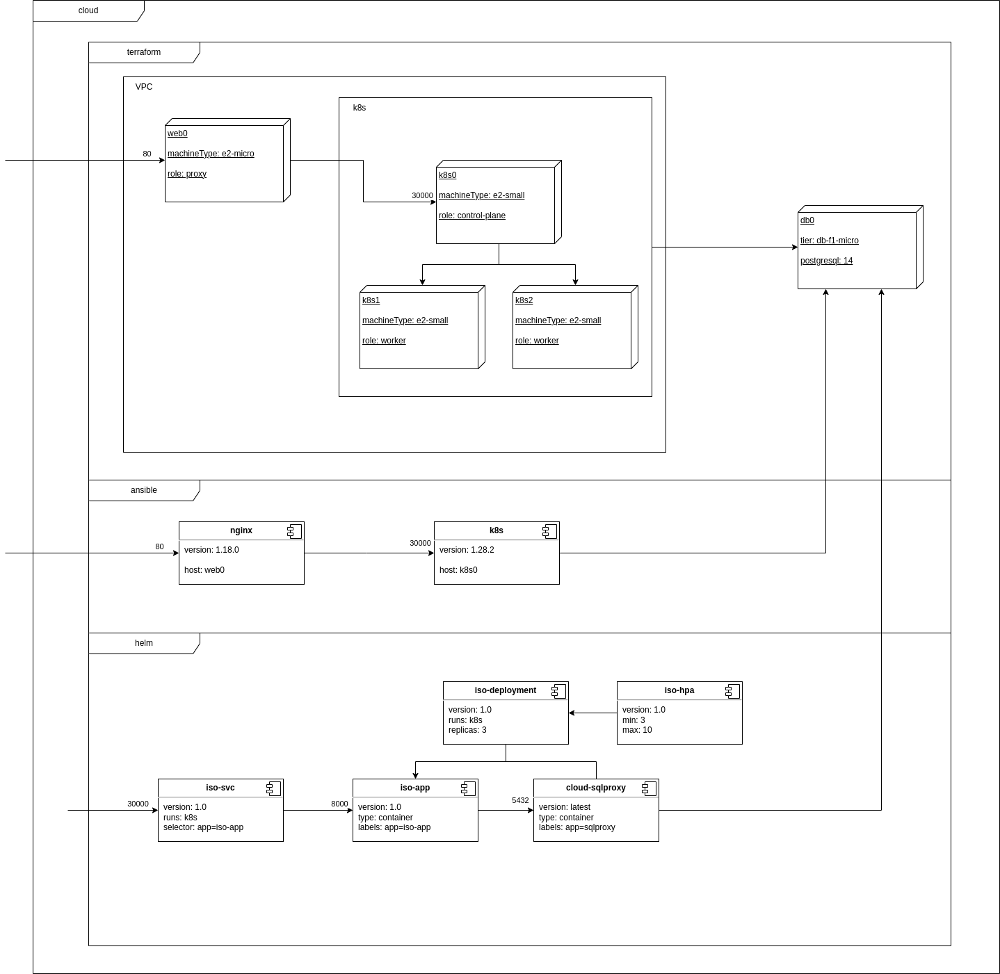
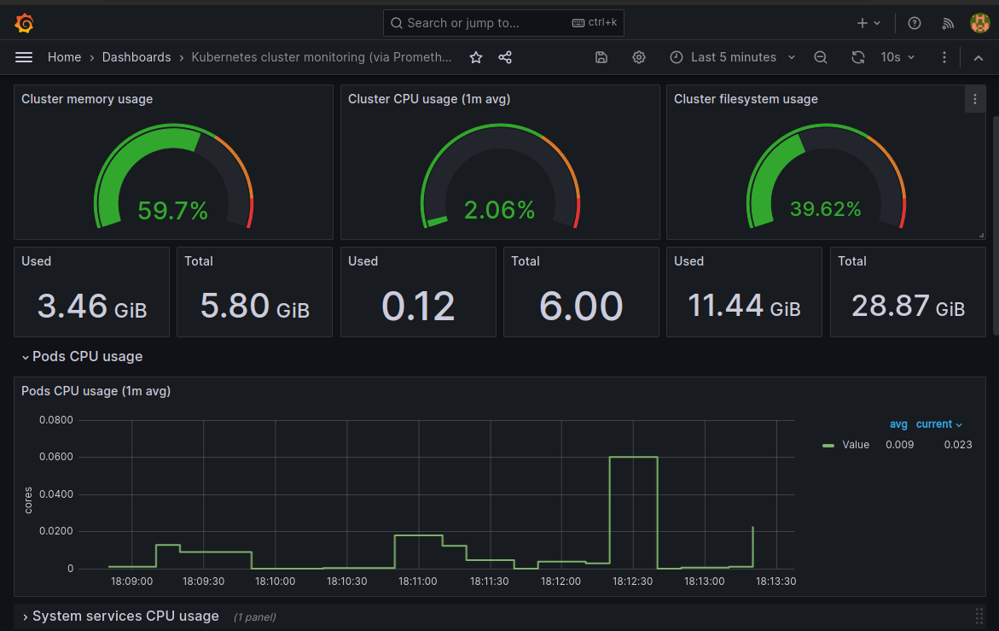
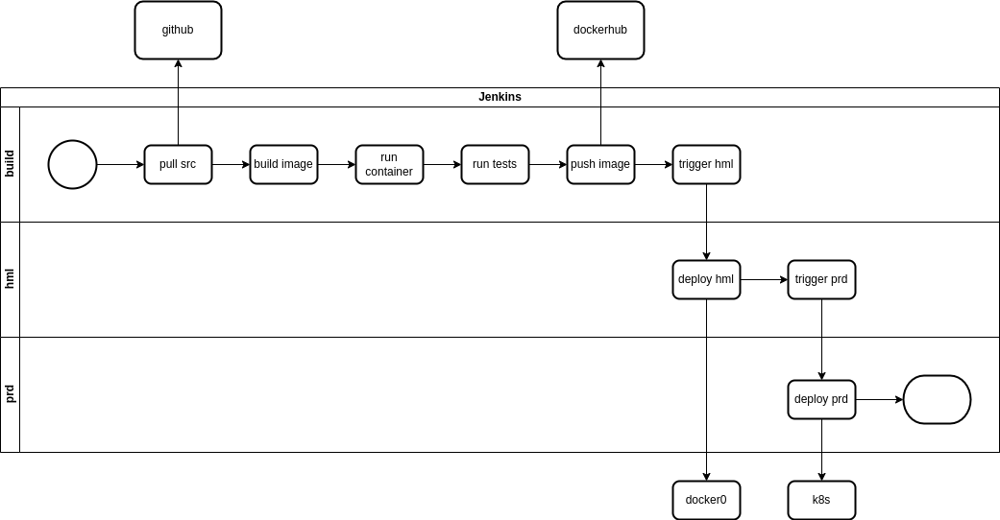

[//]: # "Title: iso-app"
[//]: # "Author: Fabio Iareke"
[//]: # "Date: 2023-09-06"
[//]: # "File: iso-app.md"
[//]: # "Summary: jBreadPaper about iso-app, k8s"

# iso-app

**Definition** (*iso-app*)

Let be a *django* (**django-app**) application running on *gunicorn* application server containerized.

Lets call it **iso-app**.

Note: **iso** derivate from the greek *isos* (equal)

```
iso-app
├── apps
│   ├── iso
│   │   ├── fixtures
│   │   └── templates
│   │        └── iso-app
│   ├── appX
│   │   ├── fixtures
│   │   └── templates
│   │        └── appX
│   └── default
│       └── fixtures
├── requirements.txt
├── setup
│   └── static
│       ├── css
│       ├── fonts
│       ├── img
│       └── js
└── templates
    └── partials
```

[//]: # "instrumentation, todo"

## iso build

> docker

`Dockerfile`

```Dockerfile
FROM python:3.10.12-slim

RUN python3 -m venv /venv

ENV PATH /venv/bin:$PATH

COPY requirements.txt /requirements.txt

RUN /venv/bin/pip install --no-cache-dir --upgrade pip && /venv/bin/pip install --no-cache-dir -r /requirements.txt

COPY apps /apps
COPY setup /setup
COPY templates /templates
COPY manage.py /manage.py

CMD ["gunicorn", "--bind", ":8000", "--threads", "8", "setup.wsgi:application"]
```

```shell
docker build -t iso-app .
```

> docker-compose

`docker-compose.yml`

```yml
version: '3'
services:
  iso:
    build:
      context: ./
      dockerfile: Dockerfile
    ports:
      - "8000:8000"
```

## iso-docker

stack using docker and nginx to run iso-app

Deploy via ansible on a stack [docker stack](#docker-stacks)

> ansible

```
ansible/
├── group_vars
│   └── appgrp.yml
├── hosts.yml
├── roles
│   ├── iso
│   │   └── tasks
│   │       └── main.yml
│   └── nginx
│       ├── files
│       │   └── default
│       ├── handlers
│       │   └── main.yml
│       └── tasks
│           └── main.yml
└── site.yml
```

```shell
ansible-playbook site.yml -i hosts.yml
```

## iso-k8s

stack using k8s and nginx to run iso-app

Deploy via helm chart on a [k8s stack](#k8s-stacks)

> helm

```
iso-chart/
├── charts
├── Chart.yaml
├── templates
│   ├── iso-deployment.yaml
│   ├── iso-hpa.yaml
│   ├── iso-svc.yaml
│   └── tests
└── values.yaml
```

```shell
helm install iso-chart ./iso-chart
```

## docker stacks

### single server



Node | Role
-----|-----
docker0 | control-plane, worker

> terraform

```
terraform/
├── docker0.tf
├── main.tf
├── vars.tf
└── vpc.tf
```

```shell
terraform plan -out docker.plan

terraform apply docker.plan
```

> vagrant

`Vagrantfile`

```Vagrantfile
Vagrant.configure("2") do |config|

  config.vm.box = "debian/bookworm64"

  config.vm.define "docker0" do |docker0_config|
     m.vm.network "public_network"
     docker0_config.vm.provider "virtualbox" do |v|
      v.memory = 512
      v.cpus = 1
     end
  end
end
```

## k8s stacks

### k8s single-server

> bare

Node | Role
-----|-----
k8s  | control-plane, worker

- OS: Debian 12
  - minimal install
    - ssh server
    - base utilities
  - pkgs
    - sudo
    - gpg

> vagrant

Using `debian/bookworm64` box for k8s VM.

Node | Role
-----|-----
k8s  | control-plane, worker

`Vagrantfile`

```Vagrantfile
Vagrant.configure("2") do |config|

  config.vm.box = "debian/bookworm64"

  config.vm.define "k8s" do |k8s_config|
     m.vm.network "public_network"
     k8s_config.vm.provider "virtualbox" do |v|
      v.memory = 3096
      v.cpus = 2
     end
  end
end
```

```shell
vagrant up
```

### k8s multi node



Node  | Role
------|-----
web0  | webserver
k8s0  | control-plane
k8s1  | worker1
k8s2  | worker2

> terraform

```
terraform/
├── web0.tf
├── k8s0.tf
├── k8s1.tf
├── k8s2.tf
├── main.tf
├── vars.tf
└── vpc.tf
```

```shell
terraform plan -out k8s.plan

terraform apply k8s.plan
```

## k8s install

- containerd: 1.6.20
- k8s: 1.28.2
- helm: 3.13.0

### manual install

yakt

https://kubernetes.io/docs/setup/production-environment/

> Forwarding IPv4 and letting iptables see bridged traffic

`/etc/modules-load.d/k8s.conf`

```
overlay
br_netfilter
```

```shell
modprobe overlay
modprobe br_netfilter
```

`/etc/sysctl.d/k8s.conf`

```
net.bridge.bridge-nf-call-iptables  = 1
net.bridge.bridge-nf-call-ip6tables = 1
net.ipv4.ip_forward                 = 1
```

```shell
sysctl --system
```
> containerd

```shell
apt install -y containerd

containerd config default > /etc/containerd/config.toml
```

enable SystemdCgroup:

`/etc/containerd/config.toml`

```
[plugins."io.containerd.grpc.v1.cri".containerd.runtimes.runc]
  ...
  [plugins."io.containerd.grpc.v1.cri".containerd.runtimes.runc.options]
    SystemdCgroup = true
```

```shell
systemctl restart containerd
```
> kubernetes

```shell
curl -fsSL https://pkgs.k8s.io/core:/stable:/v1.28/deb/Release.key | gpg --dearmor -o /etc/apt/keyrings/kubernetes-apt-keyring.gpg

echo 'deb [signed-by=/etc/apt/keyrings/kubernetes-apt-keyring.gpg] https://pkgs.k8s.io/core:/stable:/v1.28/deb/ /' | tee /etc/apt/sources.list.d/kubernetes.list

apt update

apt install -y kubelet kubeadm kubectl
```

> helm

https://helm.sh/docs/intro/install/

```shell
curl https://baltocdn.com/helm/signing.asc | gpg --dearmor -o /etc/apt/keyrings/helm-apt-keyring.gpg

echo "deb [arch=amd64 signed-by=/etc/apt/keyrings/helm-apt-keyring.gpg] https://baltocdn.com/helm/stable/debian/ all main" | tee /etc/apt/sources.list.d/helm.list

apt update

apt install -y helm
```

### ansible

The ansible install follows the same steps of manual install but automated to multiple hosts.

ansible
  - iac/gcp/iso-k8s/ansible

```
ansible/
├── group_vars
│   └── all.yml
├── hosts.yml
├── roles
│   ├── helm
│   │   └── tasks
│   │       └── main.yml
│   ├── k8s
│   │   ├── files
│   │   │   ├── k8s.conf-modules
│   │   │   └── k8s.conf-sysctl
│   │   ├── handlers
│   │   │   └── main.yml
│   │   └── tasks
│   │       └── main.yml
│   └── webserver
│       ├── files
│       │   └── default
│       ├── handlers
│       │   └── main.yml
│       └── tasks
│           └── main.yml
└── site.yml
```

```shell
ansible-playbook site.yml -i hosts.yml
```

## k8s cluster init

TLSBootstrap: true
CNI: flannel
metrics-server

To avoid TLS errors on metrics-server a kubeadm-config file is needed to bootstrap the cluster. Besides that, the default flannel cni uses a specific pod-network (10.244.0.0/16).

`kubeadm-config.yaml`

```yaml
apiVersion: kubeadm.k8s.io/v1beta3
kind: ClusterConfiguration
networking:
  podSubnet: "10.244.0.0/16"
---
apiVersion: kubelet.config.k8s.io/v1beta1
kind: KubeletConfiguration
serverTLSBootstrap: true
```

```shell
kubeadm config images pull

kubeadm init --config kubeadm-config.yaml
```

After the cluster init on control-plane, will be displayed the join command:

```shell
kubeadm join ${CONTROL_PLANE_ADDRESS}:6443 --token ${TOKEN} --discovery-token-ca-cert-hash ${DISCOVERY_TOKEN_CA_CERT_HASH}
```

This join command should be executed on worker nodes.

In case of join command is lost:

```shell
kubeadm token create --print-join-command
```

As per indication of init, the kube config files:

root:

```shell
export KUBECONFIG=/etc/kubernetes/admin.conf
```

regular user:

```shell
mkdir -p $HOME/.kube
sudo cp -i /etc/kubernetes/admin.conf $HOME/.kube/config
sudo chown $(id -u):$(id -g) $HOME/.kube/config
```

Approve the Pending csr's to fully enable TLS.

```shell
kubectl get csr
NAME        AGE   SIGNERNAME                                    REQUESTOR              REQUESTEDDURATION   CONDITION
csr-chxsh   33s   kubernetes.io/kubelet-serving                 system:node:k8s   <none>              Pending
csr-mss8h   34s   kubernetes.io/kube-apiserver-client-kubelet   system:node:k8s   <none>              Approved,Issued
csr-tcjz7   30s   kubernetes.io/kubelet-serving                 system:node:k8s   <none>              Pending

kubectl certificate approve csr-chxsh
certificatesigningrequest.certificates.k8s.io/csr-chxsh approved

kubectl certificate approve csr-tcjz7
certificatesigningrequest.certificates.k8s.io/csr-tcjz7 approved

kubectl get csr
NAME        AGE   SIGNERNAME                                    REQUESTOR         REQUESTEDDURATION   CONDITION
csr-chxsh   50s   kubernetes.io/kubelet-serving                 system:node:k8s   <none>              Approved,Issued
csr-mss8h   51s   kubernetes.io/kube-apiserver-client-kubelet   system:node:k8s   <none>              Approved,Issued
csr-tcjz7   47s   kubernetes.io/kubelet-serving                 system:node:k8s   <none>              Approved,Issued
```

At this point, the cluster is "NotReady" status due to core-dns Pending.

```shell
kubectl get nodes
NAME   STATUS     ROLES           AGE   VERSION
k8s    NotReady   control-plane   75s   v1.28.2

kubectl get pods --all-namespaces
NAMESPACE     NAME                          READY   STATUS    RESTARTS   AGE
kube-system   coredns-5dd5756b68-545hd      0/1     Pending   0          62s
kube-system   coredns-5dd5756b68-fp6hg      0/1     Pending   0          62s
kube-system   etcd-k8s                      1/1     Running   0          77s
kube-system   kube-apiserver-k8s            1/1     Running   0          77s
kube-system   kube-controller-manager-k8s   1/1     Running   0          77s
kube-system   kube-proxy-xs6vg              1/1     Running   0          62s
kube-system   kube-scheduler-k8s            1/1     Running   0          77s
```

A CNI is needed, deploy flannel CNI:

namespace: kube-flannel

```shell
kubectl apply -f https://github.com/flannel-io/flannel/releases/latest/download/kube-flannel.yml
```

Now the Cluster is Ready:

```shell
kubectl get nodes
NAME   STATUS     ROLES           AGE   VERSION
k8s    Ready      control-plane   117s  v1.28.2

kubectl get pods --all-namespaces
NAMESPACE      NAME                          READY   STATUS    RESTARTS   AGE
kube-flannel   kube-flannel-ds-2t4x5         1/1     Running   0          33s
kube-system    coredns-5dd5756b68-545hd      1/1     Running   0          102s
kube-system    coredns-5dd5756b68-fp6hg      1/1     Running   0          102s
kube-system    etcd-k8s                      1/1     Running   0          117s
kube-system    kube-apiserver-k8s            1/1     Running   0          117s
kube-system    kube-controller-manager-k8s   1/1     Running   0          117s
kube-system    kube-proxy-xs6vg              1/1     Running   0          102s
kube-system    kube-scheduler-k8s            1/1     Running   0          117s
```

If is a single node cluster (control-plane only), remove the taint to run pods:

```shell
kubectl taint nodes --all node-role.kubernetes.io/control-plane-
```

Else if is a multi node cluster exec the join command on worker nodes

```shell
kubeadm join ${CONTROL_PLANE_ADDRESS}:6443 --token ${TOKEN} --discovery-token-ca-cert-hash ${DISCOVERY_TOKEN_CA_CERT_HASH}
```

Note: after join, approve new Pending csr's.

> Helm

```shell
helm repo add stable https://charts.helm.sh/stable

helm repo update

helm repo list
NAME                	URL                                               
stable              	https://charts.helm.sh/stable
```

## monitoring

### metrics-server

Deploy via helm chart:

```shell
helm repo add metrics-server https://kubernetes-sigs.github.io/metrics-server/

helm repo update

helm repo list
NAME                	URL                                               
stable              	https://charts.helm.sh/stable                     
metrics-server      	https://kubernetes-sigs.github.io/metrics-server/ 

helm install metrics-server metrics-server/metrics-server

helm list
NAME          	NAMESPACE	REVISION	UPDATED                                	STATUS  	CHART                	APP VERSION
metrics-server	default  	1       	2023-10-12 13:32:48.207064809 -0300 -03	deployed	metrics-server-3.11.0	0.6.4
```

Pods running so far:

```shell
kubectl get pods --all-namespaces
NAMESPACE      NAME                             READY   STATUS    RESTARTS   AGE
default        metrics-server-5b76987ff-vj2sr   1/1     Running   0          45s
kube-flannel   kube-flannel-ds-2t4x5            1/1     Running   0          2m27s
kube-system    coredns-5dd5756b68-545hd         1/1     Running   0          3m36s
kube-system    coredns-5dd5756b68-fp6hg         1/1     Running   0          3m36s
kube-system    etcd-k8s                         1/1     Running   0          3m51s
kube-system    kube-apiserver-k8s               1/1     Running   0          3m51s
kube-system    kube-controller-manager-k8s      1/1     Running   0          3m51s
kube-system    kube-proxy-xs6vg                 1/1     Running   0          3m36s
kube-system    kube-scheduler-k8s               1/1     Running   0          3m51s
```

Viewing utilization with metrics-server:

```shell
kubectl top node
NAME   CPU(cores)   CPU%   MEMORY(bytes)   MEMORY%   
k8s    115m         5%     1252Mi          67%       

kubectl top pod --all-namespaces
NAMESPACE      NAME                             CPU(cores)   MEMORY(bytes)   
default        metrics-server-5b76987ff-vj2sr   5m           12Mi            
kube-flannel   kube-flannel-ds-2t4x5            8m           12Mi            
kube-system    coredns-5dd5756b68-545hd         2m           11Mi            
kube-system    coredns-5dd5756b68-fp6hg         2m           12Mi            
kube-system    etcd-k8s                         23m          30Mi            
kube-system    kube-apiserver-k8s               60m          293Mi           
kube-system    kube-controller-manager-k8s      18m          77Mi            
kube-system    kube-proxy-xs6vg                 1m           49Mi            
kube-system    kube-scheduler-k8s               4m           21Mi
```

### prometheus

Collect metrics with Prometheus.

To deploy prometheus on k8s 2 PVs (w/o storageClass) are necessary with default claims: prometheus-pv (2Gi), prometheus-server-pv (8Gi).

`prometheus-pv.yaml`

```yaml
apiVersion: v1
kind: PersistentVolume
metadata:
  name: prometheus-pv
spec:
  capacity:
    storage: 2Gi
  volumeMode: Filesystem
  accessModes:
    - ReadWriteOnce
  persistentVolumeReclaimPolicy: Delete
  #storageClassName: 
  local:
    path: /mnt/prometheus
  nodeAffinity:
    required:
      nodeSelectorTerms:
      - matchExpressions:
        - key: kubernetes.io/hostname
          operator: In
          values:
            - k8s
```

`prometheus-server-pv.yaml`

```yaml
apiVersion: v1
kind: PersistentVolume
metadata:
  name: prometheus-server-pv
spec:
  capacity:
    storage: 8Gi
  volumeMode: Filesystem
  accessModes:
    - ReadWriteOnce
  persistentVolumeReclaimPolicy: Delete
  #storageClassName: 
  local:
    path: /mnt/prometheus-server
  nodeAffinity:
    required:
      nodeSelectorTerms:
      - matchExpressions:
        - key: kubernetes.io/hostname
          operator: In
          values:
            - k8s
```

```shell
kubectl apply -f prometheus-pv.yaml

kubectl apply -f prometheus-server-pv.yaml
```

Deploy via helm chart:

```shell
helm repo add prometheus-community https://prometheus-community.github.io/helm-charts

helm repo update
 
helm repo list
NAME                	URL                                                                                            
stable              	https://charts.helm.sh/stable                     
metrics-server      	https://kubernetes-sigs.github.io/metrics-server/ 
prometheus-community	https://prometheus-community.github.io/helm-charts    

helm install prometheus prometheus-community/prometheus

helm list
NAME          	NAMESPACE	REVISION	UPDATED                                	STATUS  	CHART                	APP VERSION
metrics-server	default  	1       	2023-10-12 13:32:48.207064809 -0300 -03	deployed	metrics-server-3.11.0	0.6.4      
prometheus    	default  	1       	2023-10-12 13:34:22.666360167 -0300 -03	deployed	prometheus-25.1.0    	v2.47.0 
```

Pods running so far:

```shell
kubectl get pods --all-namespaces
NAMESPACE      NAME                                                READY   STATUS    RESTARTS   AGE
default        metrics-server-5b76987ff-vj2sr                      1/1     Running   0          3m21s
default        prometheus-alertmanager-0                           1/1     Running   0          92s
default        prometheus-kube-state-metrics-7b74466fbb-8hfjs      1/1     Running   0          92s
default        prometheus-prometheus-node-exporter-w4q2f           1/1     Running   0          92s
default        prometheus-prometheus-pushgateway-f7f8778d7-w2fkh   1/1     Running   0          92s
default        prometheus-server-68658f99df-nkwzw                  2/2     Running   0          92s
kube-flannel   kube-flannel-ds-2t4x5                               1/1     Running   0          5m3s
kube-system    coredns-5dd5756b68-545hd                            1/1     Running   0          6m12s
kube-system    coredns-5dd5756b68-fp6hg                            1/1     Running   0          6m12s
kube-system    etcd-k8s                                            1/1     Running   0          6m27s
kube-system    kube-apiserver-k8s                                  1/1     Running   0          6m27s
kube-system    kube-controller-manager-k8s                         1/1     Running   0          6m27s
kube-system    kube-proxy-xs6vg                                    1/1     Running   0          6m12s
kube-system    kube-scheduler-k8s                                  1/1     Running   0          6m27s
```

```shell
kubectl port-forward prometheus-server-68658f99df-nkwzw 9090
```

Scrap kube-state-metrics

Add kube-state-metrics job to prometheus:

```yaml
    - job_name: kube-state-metrics
      static_configs:
      - targets:
        - prometheus-kube-state-metrics.default.svc:8080
```

```shell
kubectl edit cm prometheus-server
```

New scrape_configs should be:

```yaml
...
    scrape_configs:
    - job_name: prometheus
      static_configs:
      - targets:
        - localhost:9090
    - job_name: kube-state-metrics
      static_configs:
      - targets:
        - prometheus-kube-state-metrics.default.svc:8080
...
```

targets:

kube-state-metrics (1 / 1 active targets)
kubernetes-apiservers (1 / 17 active targets)
kubernetes-nodes (1 / 1 active targets)
kubernetes-nodes-cadvisor (1 / 1 active targets)
kubernetes-service-endpoints (4 / 13 active targets)
prometheus (1 / 1 active targets)
prometheus-pushgateway (1 / 12 active targets)

### grafana

Visualize metrics with Grafana.

`grafana-pv.yaml`

```yaml
apiVersion: v1
kind: PersistentVolume
metadata:
  name: grafana-pv
spec:
  capacity:
    storage: 100Mi
  volumeMode: Filesystem
  accessModes:
    - ReadWriteOnce
  persistentVolumeReclaimPolicy: Delete
  #storageClassName: 
  local:
    path: /mnt/grafana
  nodeAffinity:
    required:
      nodeSelectorTerms:
      - matchExpressions:
        - key: kubernetes.io/hostname
          operator: In
          values:
            - k8s
```

```shell
kubectl apply -f grafana-pv.yaml
```

Deploy via helm chart:

```shell
helm repo add grafana https://grafana.github.io/helm-charts

helm repo update

helm repo list
NAME                	URL                                               
stable              	https://charts.helm.sh/stable                     
metrics-server      	https://kubernetes-sigs.github.io/metrics-server/ 
prometheus-community	https://prometheus-community.github.io/helm-charts
grafana             	https://grafana.github.io/helm-charts     

helm install grafana grafana/grafana --set persistence.enabled=true --set persistence.type='pvc' --set persistence.size='100Mi'

helm list
NAME          	NAMESPACE	REVISION	UPDATED                                	STATUS  	CHART                	APP VERSION
grafana       	default  	1       	2023-10-11 13:45:44.411239453 -0300 -03	deployed	grafana-6.60.4       	10.1.4           
prometheus    	default  	1       	2023-10-11 12:10:14.464191409 -0300 -03	deployed	prometheus-25.1.0    	v2.47.0
```

Pods running so far:

```shell
kubectl get pods --all-namespaces
NAMESPACE      NAME                                                READY   STATUS    RESTARTS   AGE
default        grafana-757c5cc896-5zjkp                            1/1     Running   0          33s
default        metrics-server-5b76987ff-vj2sr                      1/1     Running   0          7m19s
default        prometheus-alertmanager-0                           1/1     Running   0          5m30s
default        prometheus-kube-state-metrics-7b74466fbb-8hfjs      1/1     Running   0          5m30s
default        prometheus-prometheus-node-exporter-w4q2f           1/1     Running   0          5m30s
default        prometheus-prometheus-pushgateway-f7f8778d7-w2fkh   1/1     Running   0          5m30s
default        prometheus-server-68658f99df-nkwzw                  2/2     Running   0          5m30s
kube-flannel   kube-flannel-ds-2t4x5                               1/1     Running   0          9m1s
kube-system    coredns-5dd5756b68-545hd                            1/1     Running   0          10m
kube-system    coredns-5dd5756b68-fp6hg                            1/1     Running   0          10m
kube-system    etcd-k8s                                            1/1     Running   0          10m
kube-system    kube-apiserver-k8s                                  1/1     Running   0          10m
kube-system    kube-controller-manager-k8s                         1/1     Running   0          10m
kube-system    kube-proxy-xs6vg                                    1/1     Running   0          10m
kube-system    kube-scheduler-k8s                                  1/1     Running   0          10m
```

```shell
kubectl get svc --all-namespaces
NAMESPACE     NAME                                  TYPE        CLUSTER-IP      EXTERNAL-IP   PORT(S)                  AGE
default       grafana                               ClusterIP   10.108.42.165   <none>        80/TCP                   36s
default       kubernetes                            ClusterIP   10.96.0.1       <none>        443/TCP                  10m
default       metrics-server                        ClusterIP   10.96.37.216    <none>        443/TCP                  7m22s
default       prometheus-alertmanager               ClusterIP   10.108.35.77    <none>        9093/TCP                 5m33s
default       prometheus-alertmanager-headless      ClusterIP   None            <none>        9093/TCP                 5m33s
default       prometheus-kube-state-metrics         ClusterIP   10.98.27.182    <none>        8080/TCP                 5m33s
default       prometheus-prometheus-node-exporter   ClusterIP   10.99.232.198   <none>        9100/TCP                 5m33s
default       prometheus-prometheus-pushgateway     ClusterIP   10.109.73.166   <none>        9091/TCP                 5m33s
default       prometheus-server                     ClusterIP   10.96.21.171    <none>        80/TCP                   5m33s
kube-system   kube-dns                              ClusterIP   10.96.0.10      <none>        53/UDP,53/TCP,9153/TCP   10m
```

```shell
kubectl top pod --all-namespaces
NAMESPACE      NAME                                                CPU(cores)   MEMORY(bytes)   
default        grafana-757c5cc896-5zjkp                            6m           110Mi           
default        metrics-server-5b76987ff-vj2sr                      4m           26Mi            
default        prometheus-alertmanager-0                           2m           24Mi            
default        prometheus-kube-state-metrics-7b74466fbb-8hfjs      1m           21Mi            
default        prometheus-prometheus-node-exporter-w4q2f           1m           16Mi            
default        prometheus-prometheus-pushgateway-f7f8778d7-w2fkh   1m           17Mi            
default        prometheus-server-68658f99df-nkwzw                  4m           179Mi           
kube-flannel   kube-flannel-ds-2t4x5                               10m          24Mi            
kube-system    coredns-5dd5756b68-545hd                            2m           23Mi            
kube-system    coredns-5dd5756b68-fp6hg                            3m           22Mi            
kube-system    etcd-k8s                                            23m          48Mi            
kube-system    kube-apiserver-k8s                                  67m          295Mi           
kube-system    kube-controller-manager-k8s                         19m          60Mi            
kube-system    kube-proxy-xs6vg                                    1m           25Mi            
kube-system    kube-scheduler-k8s                                  4m           25Mi 
```

```shell
kubectl port-forward grafana-757c5cc896-5zjkp 3000
```

Create a Prometheus data source pointing to prometheus-server (ClusterIP)

Type: Prometheus
Name: Prometheus
Prometheus server URL: http://prometheus-server

Create or import a dashboard using Prometheus data source

kubernetes-cluster-monitoring-via-prometheus.json



## jenkins



```
jenkins/
├── iso-app.gvy
├── iso-app-hml.gvy
└── iso-app-prd.gvy
```
